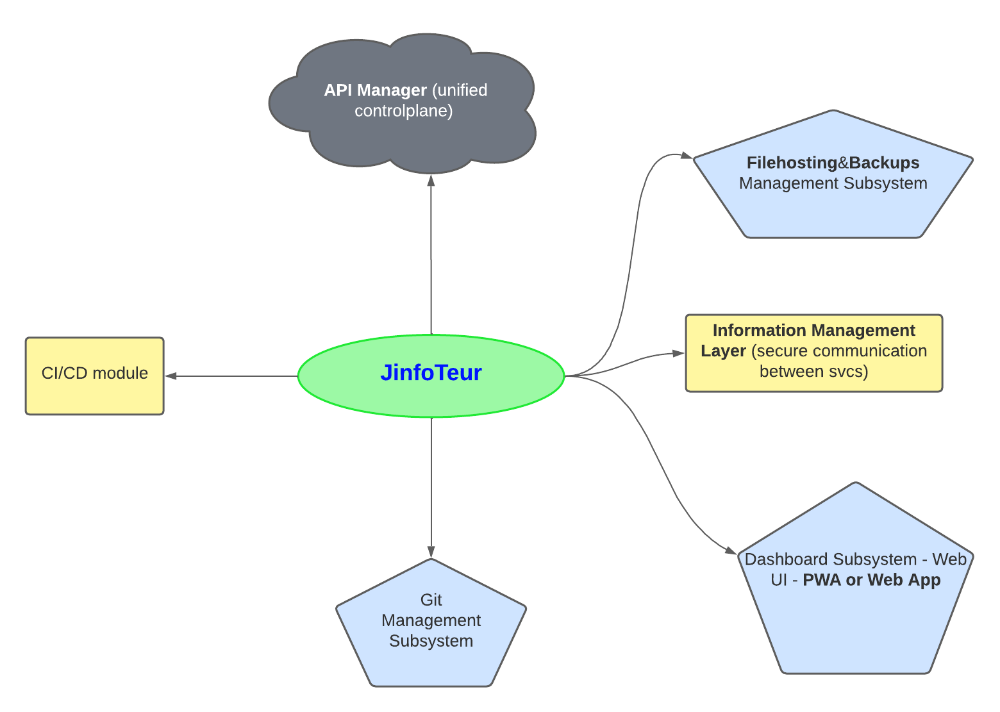

# JinfoTeur.

Jinfoteur ("Jigth Informateur" or "Jigth Information System") is a system to manage information of different kinds in an efficient way, using Free Software and Open source technologies to do its different functionalities.

There are a lot of information systems out there but too often we use what has already been made for us, not questioning how does it work in practice, I think that the practice and practical results are the best way to learn about new topics and show something authentically, so this is a project to apply knowledge and technologies with some creativity.

If you want to contribute feel free to leave a Pull Request (prefferably with legible code and some little abstract on what does it do) or an Issue with your ideas for improvement (it doesn't have to be code to be useful).

Also this project is licensed as MIT so you are free to use it however you want without any guarantee or responsibility by my part. Clone it, fork it, modify it and learn by doing!

## General Description:

The idea is to be able to upload and manage different kinds of digital content (multimedia files, images, video, text, etc) allowing for multiple visibility levels for them (private or public), expose that content through an API and some Frontend client (PWA or Web client).

## Most Important Domain Concepts of this app.

1. Everything's based around the concept of integrations with other services whenever possible, ideally they should be cheap or "free" (able to be self-hosted).

2. Categories and tags will act as a means to organize information, the idea is to make the system as flexible as possible. Initially most categories will be created as default categories, with the possibility to create more categories with a default UI/UX and functionality (personalization in this matter is not a priority).

3. It will be possible to create arbitrary subcategories within any subcategory to further organize its information.

4. Global search functionality will be implemented to browse information more easily.

## Architecture:

The following diagram is a result of a thought process about an information system that allows to manage information in the most simple possible (yet secure) way. Premium or GoodToHave features are intentionally avoided initially to focus all energy into the MustHave features.

This diagram may evolve and change completely in form but the main purpose of it is to manage information in an efficient, flexible way, performance and usability will have priority over security as this system is not intended to be used in production or in some kind of business (at least initially) but as a way to organize ideas and be able to self-host everything or most of the system with as little computing resources and cost as possible. Nonetheless some really basic security will be used specially in transport protocols and In-Place files storage.

The diagram above has its own notation to it and its explained below:

* **Yellow Squares:** These are cross-cutting modules, may comunicate with multiple modules (most or all) on _JinfoTeur_.

* **Blue Pentagons:** These are specific modules of the application, each own may expose its own API and may be their own MicroService or may even be just folders located into a monolith-type application. The final decision on how to organize these modules will be mainly a practical one that optimizes cost and resources usage, as the main users of these system may be just individuals who wanna manage their own information in a single platform that can be customized for the specific needs of each user.

* **Gray Clouds:** These are "Integration or utility Modules", they may integrate multiple APIs, or some common processes, such as scripts, formatting, recurrent programming jobs, etc. They are grouped together for usage convenience and some standarization (not having each module use its solution for the same problem if that solution can be abstracted and then shared between modules).
